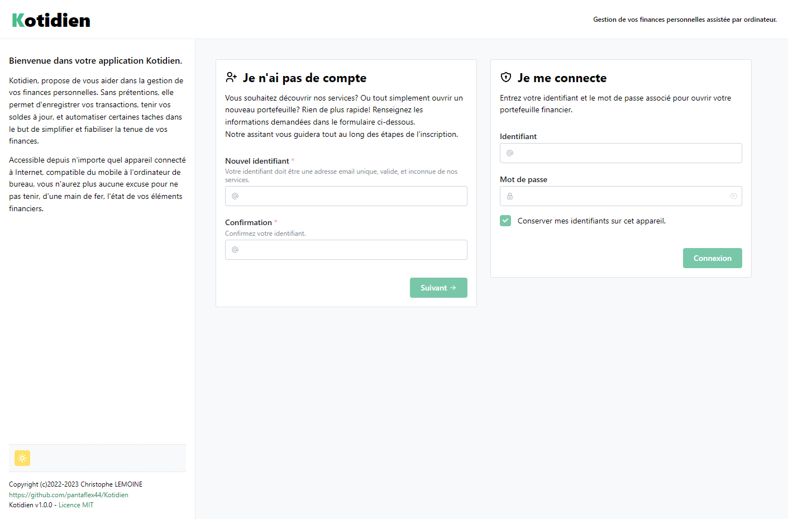
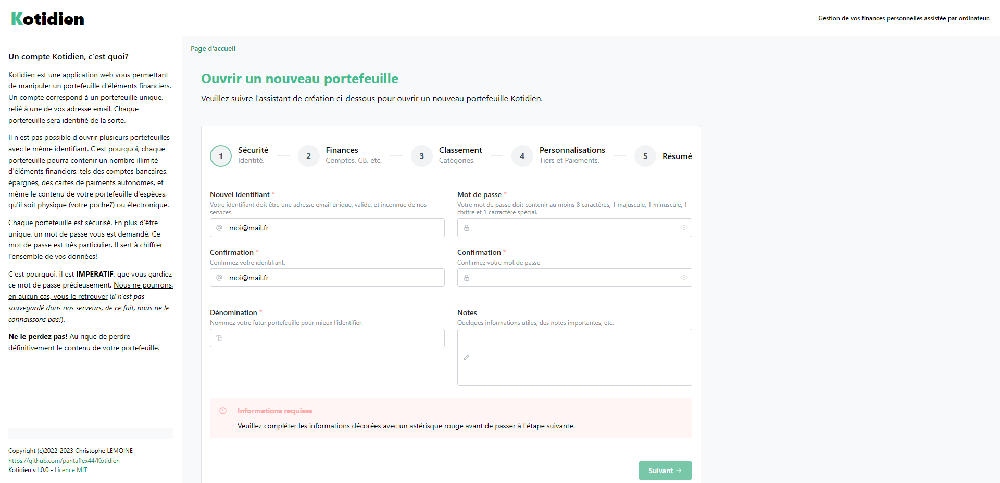
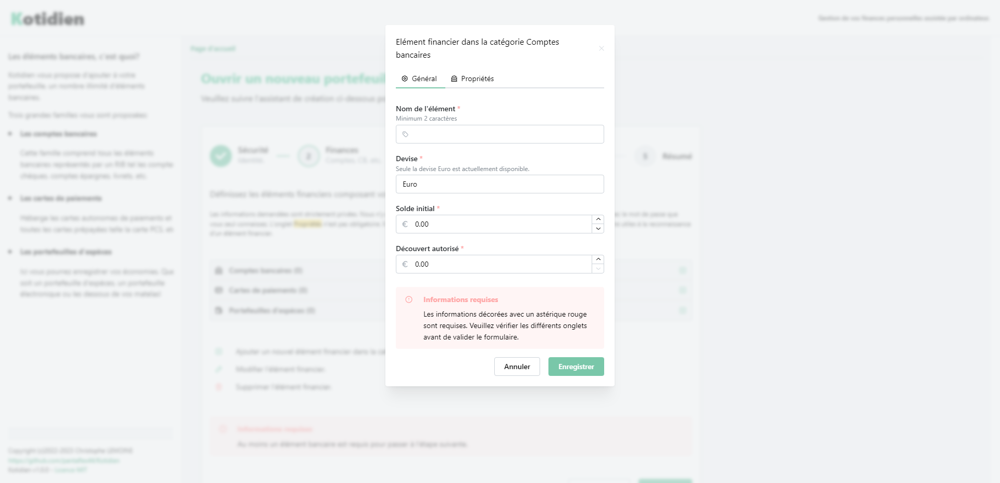
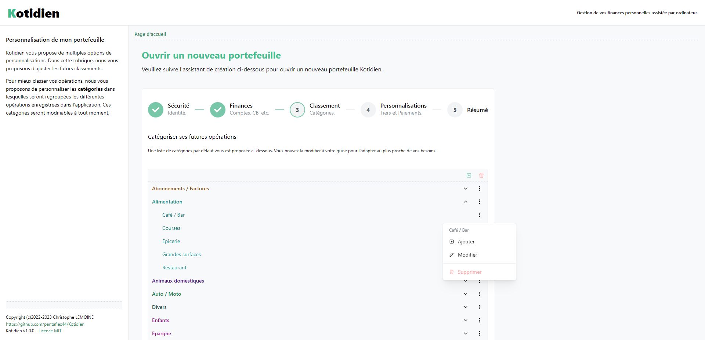
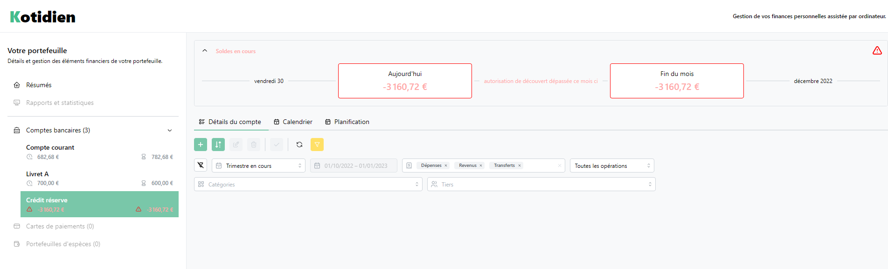
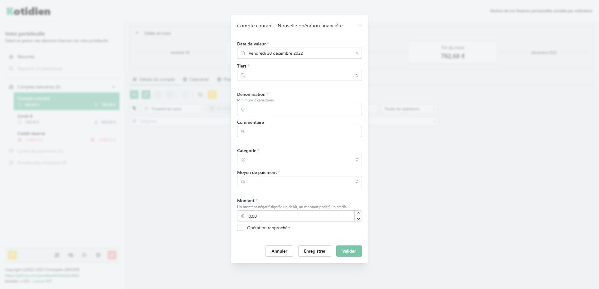
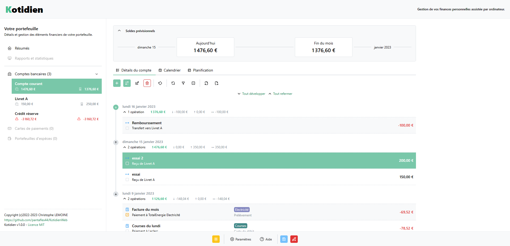

[EN COURS DE DEVELOPPEMENT]

# Kotidien
### Finances personnelles assistées par ordinateur.

Kotidien est une application dédiée à la gestion de votre argent. Comptes bancaires, cartes de paiements autonomes, et portefeuille d'espèces. Totalement libre et gratuite, elle vous permets de tenir vos comptes d'une main de fer. Écrite en Javascript, utilisant les technologies modernes telles NextJs et React.

Kotidien vous donne un accès permanent et en temps réel sur vos différents soldes, permets aussi d'automatiser l'écriture de vos transaction récurrentes, de pointer celles mises à jour sur votre interface bancaire, etc

Agencées au jour le jour, supplantées par une vue calendrier, et synthétisées sur des graphiques clairs, toutes vos transactions sont réunies au sein de Kotidien.
La complétion automatique des différentes informations permet une saisie plus rapide des données.

## Informations

Copyleft (c)2022-2023 Christophe LEMOINE
Licence MIT

https://github.com/pantaflex44/KotidienWeb

Date de création 11/11/2022

Kotidien est sous licence libre et open-source. Cette licence vous permet de redistribuer, modifier et améliorer Kotidien à votre guise. Toute modification, redistribution ou amélioration devra citer l'auteur original dans le respect de la licence.

## Captures d'écran

