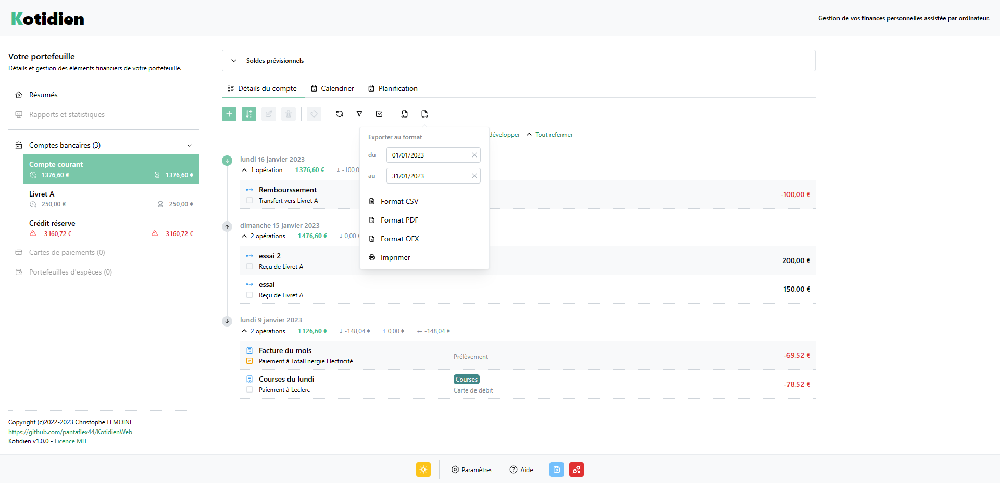
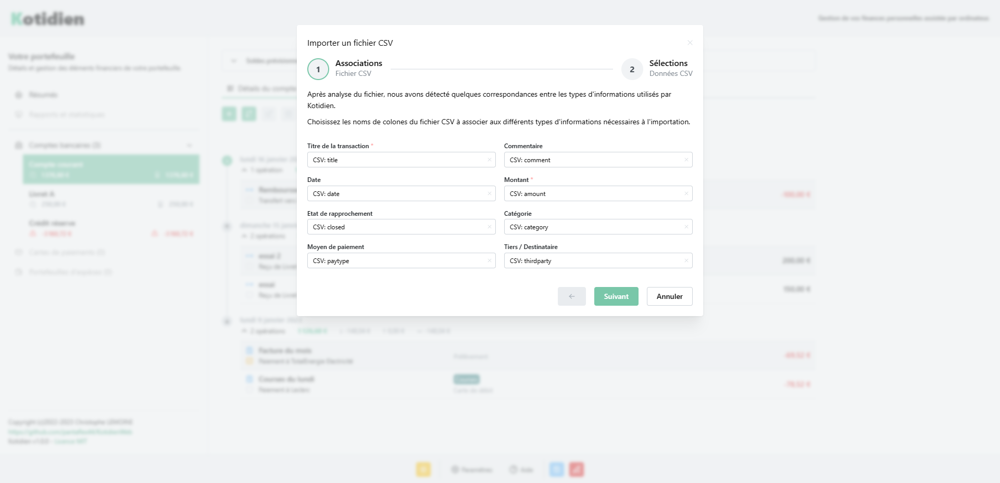

[EN COURS DE DEVELOPPEMENT]

# Kotidien

### Finances personnelles assistées par ordinateur.

Kotidien est une application dédiée à la gestion de votre argent. Comptes bancaires, cartes de paiements autonomes, et portefeuille d'espèces. Totalement libre et gratuite, elle vous permets de tenir vos comptes d'une main de fer. Écrite en Javascript, utilisant les technologies modernes telles NodeJs et React.

Kotidien vous donne un accès permanent et en temps réel sur vos différents soldes, permets aussi d'automatiser l'écriture de vos transaction récurrentes, de pointer celles mises à jour sur votre interface bancaire, etc

Agencées au jour le jour, supplantées par une vue calendrier, et synthétisées sur des graphiques clairs, toutes vos transactions sont réunies au sein de Kotidien.
La complétion automatique des différentes informations permet une saisie plus rapide des données.

#### Points forts

- **Interface claire à l'apparence modifiable**. Thème clair / sombre, diverses options d'agencement, etc.
- **Multi plateforme**. Ordinateurs, tablettes, et tous autres appareils mobiles (ou pas) connectés permettent d'accéder à Kotidien. L'interface s'adapte automatiquement. Top, non?
- **Totalement en ligne**. Accessible de partout et depuis n'importe quel appareil connecté à Internet.
- **Complètement sécurisée**. Vos données sont sauvegardées de manière sécurisée. Elles sont cryptées via un mot de passe dont seul en avez la connaissance. Un seul portefeuille par compte permissible.
- **Dynamique et en temps réel**. Les jours se suivent mais ne se ressemblent pas. Kotidien se mets automatiquement à jour en fonction de la date courante sans devoirs ré-ouvrir votre portefeuille.
- **Française et en Français**! Et oui, Kotidien est une application tricolore, qui vous parle français :-)
- **Prédictive**. Vos soldes sont automatiquement calculés, qu'ils soient passés mais aussi futurs! Vous savez à tout instant quel sera votre solde à la fin du mois. Attention au découvert. Kotidien le surveille.
- **Ouverte sur le monde**. Importer les données depuis votre banque, ou les exporter sur votre ordinateur n'a jamais été aussi simple. Plusieurs formats supportés, tels le CSV, l'OFX, le PDF, et même l'impression.
- **Planifier et organiser**. C'est le but de Kotidien. Chaque transaction est organisée par catégorie, type, tiers, etc. Une planification automatique est aussi disponible vous permettant, via des modèles, d'enregistrer des transactions automatiques et répétitives. Pratique pour pré-enregistrer les opérations récurrentes ;-)
- **Libre de droits**. Enfin, à un détail prêt: respecter la licence libre MIT dont dépend Kotidien et ce quelle impose. A part celà, vous êtes libre de redistribuer, modifier et améliorer Kotidien à votre guise.
- **Totalement gratuite**! Pourquoi payer pour économiser?

#### Points faibles

- **Totalement en ligne**. Et oui, vous devez posséder une connexion Internet pour y accéder.
- **Française et en Français**! Pour le moment, seule la langue française est prise en charge. L'Euro est aussi la seule devise disponible. Peut être plus tard, Kotidien s'ouvrira au reste du monde financier.
- et tout ceux que vous nous signalerez via nos différents moyens de contact!

## Informations

Copyright (c)2022-2023 Christophe LEMOINE
Licence MIT

https://github.com/pantaflex44/KotidienWeb

Date de création 11/11/2022

Kotidien est sous licence libre et open-source. Cette licence vous permet de redistribuer, modifier et améliorer Kotidien à votre guise. Toute modification, redistribution ou amélioration devra citer l'auteur original dans le respect de la licence.

## Crédits et Participations

    Auteurs: 
    --------
    - Christophe LEMOINE - pantaflex at tuta point io

    API:
    ----
    - Christophe LEMOINE - pantaflex at tuta point io

    UI/UX:
    ------
    - Christophe LEMOINE - pantaflex at tuta point io

    Logos:
    ------
    - Christophe LEMOINE - pantaflex at tuta point io

    Traductions:
    ------------
        [FR]
            - Christophe LEMOINE - pantaflex at tuta point io

## Librairies utilisées

[ReactJs](https://fr.reactjs.org/) , [Mantine](https://mantine.dev/) , [Tabler Icons](https://tabler-icons.io/) , [Webpack](https://webpack.js.org/) , [BabelJs](https://babeljs.io/) , [NodeJs](https://nodejs.org/fr/) , [ExpressJs](https://expressjs.com/fr/) , [Sql.js](https://github.com/sql-js/sql.js/) , [DayJs](https://day.js.org/) , [jsPdf](https://github.com/parallax/jsPDF), [@wademason/ofx](https://github.com/WadeMason/ofx)

## Captures d'écran

*Accueil*

---

*Nouveau portefeuille*

---

*Elément financier*

---

*Les catégories*

---

*Nouvelle opération*

---

*Liste des opérations*

---

*Menu d'exportations*

---

*Importation CSV*

---

